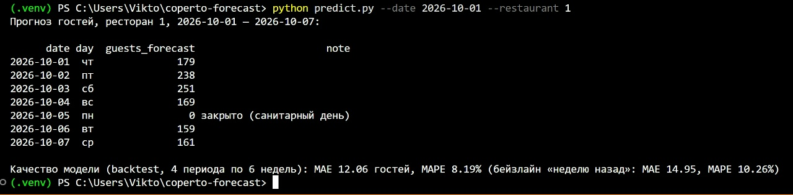

# Прогноз потока гостей ресторана на 7 дней

Модель прогнозирует число гостей ресторана на каждый из следующих 7 дней.
Скрипт `predict.py` принимает дату и ресторан и печатает прогноз вместе с метрикой качества.



## Результаты

Метрики считаются только по дням, когда ресторан работал и данные достоверны
(без санитарных дней, сбоев выгрузки и выбросов).

**Отложенный период — последние 6 недель** (20.08–30.09.2026, 81 день):

| Модель | MAE, гостей | MAPE |
|---|---|---|
| Бейзлайн: тот же день неделю назад | 13.8 | 10.1% |
| Линейная модель (Ridge на логарифмах) | 11.0 | 7.7% |
| Градиентный бустинг | 9.7 | 7.1% |

**Backtest — 4 последовательных периода по 6 недель** (апрель–сентябрь 2026, среднее ± разброс):

| Модель | MAE, гостей | MAPE |
|---|---|---|
| Бейзлайн | 14.9 ± 1.1 | 10.3% |
| **Линейная модель** | **12.1 ± 1.2** | **8.2%** |
| Градиентный бустинг | 13.0 ± 2.4 | 8.9% |

На последних 6 неделях точнее бустинг, но одно окно — это всего ~80 дней, и метрика на нём
шумная. На четырёх периодах линейная модель в среднем точнее и вдвое стабильнее, поэтому
финальная модель — **линейная**: она обыгрывает бейзлайн в каждом периоде (ошибка ниже ~20%)
и интерпретируема.

### Что это значит для бизнеса

Прогноз ошибается в среднем на **12 гостей в день** при среднем потоке ~170 (ресторан 1)
и ~95 (ресторан 2), то есть примерно на **8%**. Систематического смещения нет: модель одинаково
часто ошибается вверх и вниз. Самые крупные ошибки (~30 гостей) сопоставимы со случайным
разбросом самого потока (√190 ≈ 14 гостей — одно стандартное отклонение), то есть это
неустранимый шум, а не пропущенная закономерность.

Для **планирования смен** такой точности достаточно: ошибка в 12 гостей меньше загрузки
одного официанта за смену, а разница между будним днём и субботой (+45–70%) прогнозируется
уверенно. Для **закупок** стоит закладывать запас порядка ±10% к прогнозу.
По сравнению с правилом «как неделю назад» модель снижает ошибку на ~20%.

## Данные

Датасет синтетический, его генерирует `src/generate_data.py` (зерно `SEED = 42`, повторный
запуск даёт тот же файл). Два ресторана: №1 с 01.10.2024, №2 открылся 01.03.2025; данные
по 30.09.2026. Колонки: `date`, `restaurant_id`, `guests`, `revenue`.

Модель ряда:

```
guests_t ~ Poisson(λ_t),   λ_t = L(t) · W(день недели) · S(день года) · H(праздник)
```

- `L` — тренд (+12% и +5% в год) и «раскрутка» нового ресторана в первые месяцы;
- `W` — недельная сезонность (пт ×1.25, сб ×1.35, пн ×0.80);
- `S` — годовая сезонность с пиком в июле (веранды);
- `H` — праздники (31 декабря ×1.8, 8 марта ×1.7, 1 января ×0.6 и др.) и корпоративы в декабре.

В данные намеренно внесены дефекты реальной выгрузки: ~2% пропущенных дней и блок из
5 дней подряд (сбой выгрузки), 3 выброса на ресторан (ошибка ввода, значение ×3),
дубликаты строк и санитарные дни (первый понедельник месяца, 0 гостей).

## Как запустить

```bash
python -m venv .venv
.venv\Scripts\activate            # Windows; на Linux/Mac: source .venv/bin/activate
pip install -r requirements.txt

python -m src.generate_data       # сгенерировать data/raw/guests.csv (уже есть в репозитории)
python -m src.model               # backtest + обучить финальную модель -> models/
python predict.py --date 2026-10-01 --restaurant 1
python predict.py --date 2026-10-01 --restaurant 2 --output forecast.csv
pytest                            # тесты признаков, в т.ч. на утечку из будущего
```

`--date` — первый день прогноза; используется только история до этой даты.

## Решения и почему

**Пропуски — три разных случая.** Санитарный день остаётся в данных с нулём и флагом
`is_closed`: он известен по графику, прогноз на него — 0 без модели, в обучение и метрики
не входит. Сбой выгрузки восстанавливается в календаре строкой с `NaN` и флагом `is_missing`,
а не заполняется нулём: иначе модель решила бы, что гостей не было. Дни до открытия
ресторана 2 не создаются вовсе: календарь каждой точки начинается с её первого дня.
Строки не удаляются, чтобы `shift(7)` всегда означал «неделю назад».

**Выбросы.** День считается выбросом, если гостей в 2.5 раза больше (или меньше) медианы того
же дня недели в соседних неделях. Самые сильные праздники дают ~×1.7, поэтому порог их не
задевает: Новый год — событие, а не выброс. Выбросы не удаляются молча: исходное значение
сохраняется в `guests_raw`, а в целевой ставится `NaN`.

**Признаки.** Все признаки, вычисляемые из числа гостей, сдвинуты минимум на 7 дней: лаги
7/14/21/28 (пики автокорреляции в EDA) и среднее/разброс за 4 недели, заканчивающиеся за
неделю до дня прогноза. Поэтому весь 7-дневный прогноз строится одной моделью без рекурсии.
Календарные признаки (день недели, месяц, выходной, праздник, 1 января) известны заранее.
Отсутствие утечки проверяется тестом: изменение «будущего» не меняет признаки прошлого.

**Модель.** Ряд мультипликативный, поэтому линейная модель обучается на `log(1 + гости)`
с логарифмами лагов: произведение множителей превращается в сумму. Предобработка
(заполнение пропусков, масштабирование, one-hot) — внутри `Pipeline` и настраивается
только на обучающих данных.

**Валидация и метрика.** Разбиение строго по времени; дополнительно — backtest на 4 окнах,
потому что одно окно в 6 недель даёт шумную оценку. Основная метрика — **MAE**: она измеряется
в гостях, напрямую переводится в решения о сменах и закупках и устойчива к редким крупным
ошибкам. **MAPE** — вспомогательная: позволяет сравнивать рестораны разного масштаба
(15 гостей — это 9% для ресторана 1 и 16% для ресторана 2), но не определена в дни
с нулём гостей и сильнее штрафует ошибки в «слабые» дни.

## Структура проекта

```
data/raw/guests.csv          сырые данные (сгенерированы src/generate_data.py)
notebooks/01_eda.ipynb       исследование данных и выводы
notebooks/02_modeling.ipynb  сравнение моделей, backtest, интерпретация, разбор ошибок
src/generate_data.py         генерация синтетического датасета
src/data.py                  загрузка, дубликаты, восстановление календаря, выбросы
src/holidays.py              календарь праздников
src/features.py              признаки (одна функция для обучения и прогноза)
src/validation.py            разбиение по времени, метрики, бейзлайн, backtest
src/model.py                 модели, обучение, сохранение и загрузка
predict.py                   CLI: прогноз на 7 дней
tests/test_features.py       тесты признаков, в т.ч. на утечку из будущего
models/                      сохранённая модель и её метрики
```

## Что бы я доделал

- Проверить подход на реальной выгрузке кассы: синтетика не содержит всех особенностей
  реальных данных (погода, локальные события, акции).
- Интервал неопределённости: квантильная регрессия (pinball loss) для прогноза вида
  «от 150 до 200 гостей» вместо одной точки.
- Отдельные модели или признаки для горизонтов 1–6 дней: для ближайших дней можно
  использовать более свежие лаги, сейчас все признаки сдвинуты на 7 дней.
- Загружать график работы ресторанов из данных, а не задавать правилом в коде.
- Упаковать инференс в Docker или FastAPI-эндпоинт.